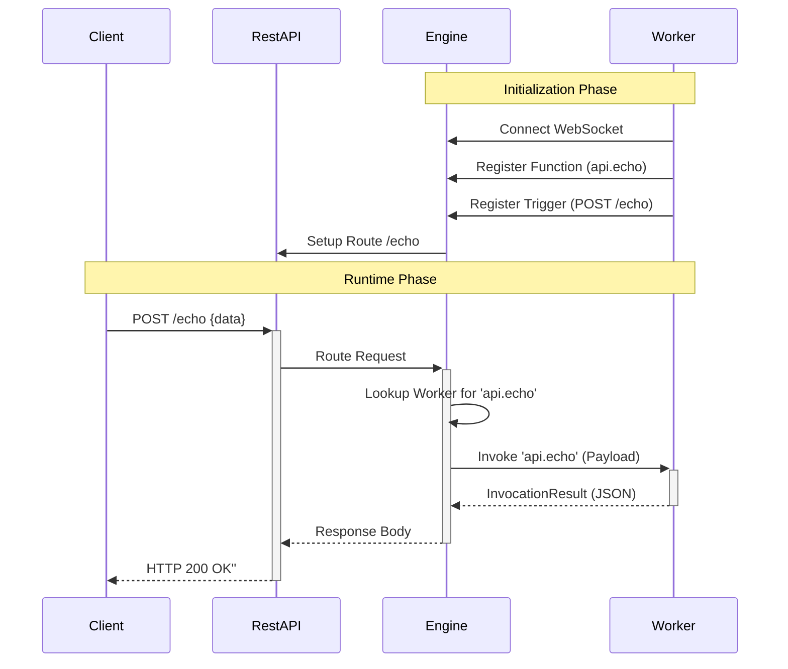
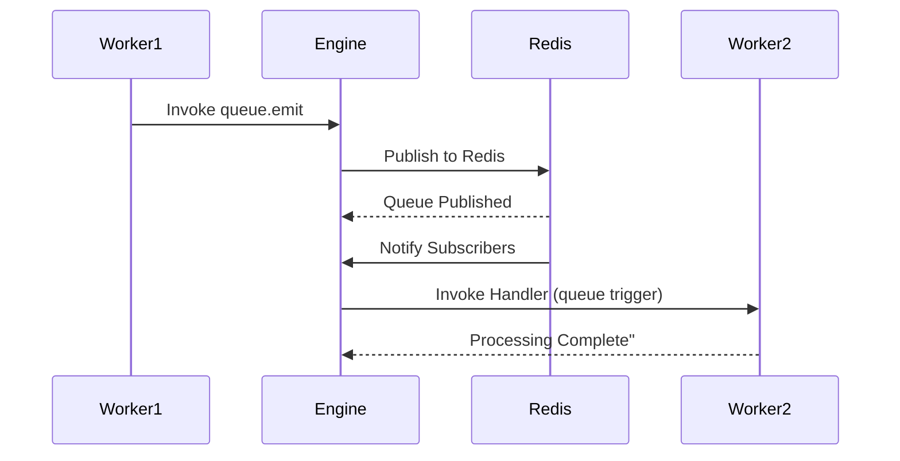
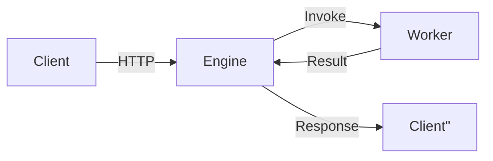

# Welcome to iii


**iii** (pronounced "three eye") is a backend engine that unifies your entire infrastructure—APIs, background jobs, workflows, queues, state, and everything else—into a single, durable runtime.

The engine model creates a "Modular Monolith" that scales like microservices but removes their architectural complexity which makes your application feel and behave like a cohesive whole no matter where it is running.

It creates this experience by transforming every backend operation into two core concepts: Call and Register. These concepts are the mechanism by which most architectural complexity is removed.

> React revolutionized the frontend with the Component and Context. Rust revolutionized systems programming with Ownership and Borrowing. iii hopes to do the same on the backend with Call and Register.

# Architecture Overview

Understanding the iii architecture helps you build more efficient and scalable applications.

## System Components

The iii architecture consists of three main layers:

1. **Engine Core** - Manages worker connections, routing, and module lifecycle
2. **Core Modules** - Provide interfaces to external systems (HTTP, Redis, WebSocket)
3. **Workers** - External processes that execute business logic

```mermaid
graph TD
    subgraph &#x22;External World&#x22;
        Client[HTTP Client]
        Redis[(Redis)]
        User[WebSocket<br/>User]
    end

    subgraph &#x22;iii Engine Process&#x22;
        Core[Engine Core]
        Reg[Worker<br/>Registry]

        subgraph &#x22;Core Modules&#x22;
            API[RestApiModule]
            Stream[StreamModule]
            Log[LoggingModule]
            Queue[QueueModule]
            Cron[CronModule]
        end
    end

    subgraph &#x22;Worker Processes&#x22;
        W1[Node.js<br/>Worker]
        W2[Python<br/>Worker]
    end

    Client -->|HTTP<br/>Request| API
    User -->|WS<br/>Message| Stream

    API --> Core
    Stream --> Core

    Core -->|Lookup| Reg
    Core -->|Invoke<br/>Function| W1
    Core -->|Invoke<br/>Function| W2

    W1 -->|Register| Core
    W2 -->|Register| Core

    Queue -.->|Persist/Sub| Redis
    Stream -.->|State| Redis
    Cron -.->|Locks| Redis
    Log -.->|Store| Redis"
```

## Worker Registry

The Worker Registry tracks connected workers and their registered functions:

| Component        | Description                                          |
| ---------------- | ---------------------------------------------------- |
| `WorkerRegistry` | Thread-safe map storing active workers by UUID       |
| `Worker`         | Represents a connected client with WebSocket channel |
| `function_paths` | Set of function paths the worker can execute         |
| `invocations`    | Active request IDs being processed                   |

## Communication Flow

### HTTP Request to Worker



### Queue Publishing



## Module Architecture

Core Modules implement the `CoreModule` trait and bridge external protocols to internal function calls.

### REST API Module

Maps HTTP routes to internal function paths using a hot router:

* **Dynamic Registration**: Routes can be added at runtime
* **Path Router**: Links HTTP method + path to function
* **Request Mapping**: Converts HTTP requests to function invocations

### Streams Module

Manages real-time state and WebSocket connections:

* **State Management**: Get/set/delete operations on hierarchical data
* **Real-time Sync**: WebSocket-based state synchronization
* **Authentication**: Optional auth function for connection validation

### Queue Module

Implements publish-subscribe pattern:

* **Adapters**: Pluggable backends (Redis, In-Memory)
* **Topics**: Subscribe to specific queue topics
* **Async Processing**: Non-blocking queue distribution

### Cron Module

Handles distributed scheduling:

* **Cron Parser**: Supports standard cron expressions
* **Distributed Locks**: Prqueues duplicate execution across instances
* **Job Management**: Tokio-based task scheduling

## Data Flow Patterns

### Synchronous Pattern (API Requests)



### Asynchronous Pattern (Queues)

```mermaid
graph TD
    Publisher[Publisher] -->|Emit| Engine[Engine]
    Engine -->|Store| Redis[(Redis)]
    Redis -.->|Notify| Engine
    Engine -->|Invoke| Sub1[Subscriber 1]
    Engine -->|Invoke| Sub2[Subscriber 2]"
```

### Scheduled Pattern (Cron)

```mermaid
graph TD
    Scheduler[Cron Scheduler] -->|Tick| Lock{Acquire Lock?}
    Lock -->|Success| Execute[Execute Function]
    Lock -->|Fail| Skip[Skip Execution]
    Execute -->|Complete| Release[Release Lock]"
```

## Scalability Considerations

### Horizontal Scaling

Run multiple engine instances with shared Redis:

* **Stateless Workers**: Connect to any engine instance
* **Shared State**: Redis provides distributed state
* **Load Distribution**: HTTP load balancer for API requests
* **Lock-based Coordination**: Cron jobs use distributed locks

### Vertical Scaling

Optimize single instance performance:

* **Rust Performance**: Core modules built for speed and memory efficiency
* **Async Runtime**: Tokio for concurrent request handling
* **Connection Pooling**: Efficient WebSocket management
* **Adapter Optimization**: Redis pipelining, connection pooling

## Extension Points

### Custom Modules

Build custom core modules by implementing the `CoreModule` trait:

1. Define module configuration
2. Implement initialization logic
3. Register trigger types
4. Expose functions to workers

### Custom Adapters

Replace default adapters with custom implementations:

* **Queue Adapters**: Alternative message brokers (RabbitMQ, Kafka)
* **Stream Adapters**: Different storage backends
* **Cron Adapters**: Alternative scheduling systems
* **Logging Adapters**: Custom log destinations
